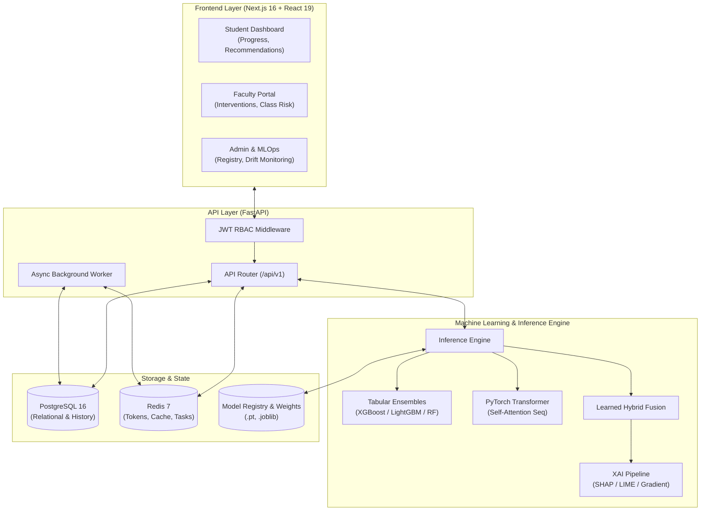

# 🎓 EduPredict: Student Performance AI Platform

[](https://nextjs.org/)
[](https://react.dev/)
[](https://fastapi.tiangolo.com/)
[](https://pytorch.org/)
[](https://www.postgresql.org/)
[](https://redis.io/)
[](https://www.docker.com/)
[](LICENSE)

> **A Hybrid Machine Learning & Deep Transformer Framework for Early Academic Risk Prediction, Transparent Explainability (XAI), and Personalized Learning Interventions.**

---

## 📌 Table of Contents

- [Overview](#-overview)
- [Key Highlights & Capabilities](#-key-highlights--capabilities)
- [System Architecture](#-system-architecture)
- [Tech Stack](#-tech-stack)
- [Machine Learning & AI Pipeline](#-machine-learning--ai-pipeline)
  - [Temporal Transformer](#1-temporal-transformer)
  - [Hybrid Deep Fusion Architecture](#2-hybrid-deep-fusion-architecture)
  - [Explainable AI (XAI)](#3-explainable-ai-xai)
  - [Prescriptive Recommendation Engine](#4-prescriptive-recommendation-engine)
- [Research Benchmark & Evaluation](#-research-benchmark--evaluation)
- [Project Directory Structure](#-project-directory-structure)
- [Getting Started & Installation](#-getting-started--installation)
  - [Option A: One-Command Docker Setup (Recommended)](#option-a-one-command-docker-setup-recommended)
  - [Option B: Local Native Setup](#option-b-local-native-setup)
- [Demo Credentials](#-demo-credentials)
- [API Documentation](#-api-documentation)
- [MLOps, Monitoring & Drift Detection](#-mlops-monitoring--drift-detection)
- [Comprehensive Technical Documentation](#-comprehensive-technical-documentation)
- [Testing & Quality Assurance](#-testing--quality-assurance)
- [Ethical AI & Academic Disclaimer](#-ethical-ai--academic-disclaimer)

---

## 🌟 Overview

**EduPredict (Student-Performance-AI)** is an end-to-end institutional intelligence and student analytics platform. It combines traditional machine learning regressors/classifiers with deep temporal **Transformer encoders** to detect academic struggle early in the semester.

Beyond raw prediction scores, the platform implements **Explainable AI (SHAP, LIME, and Gradient-based Feature Attribution)** to tell educators *why* a student is at risk, while generating personalized, actionable study plans and resource recommendations to close learning gaps.

```
┌─────────────────┐       ┌───────────────────────────────┐       ┌─────────────────────────────┐
│  Student Data   │ ────► │      Hybrid AI Predictor      │ ────► │  Explainability & Action    │
│                 │       │                               │       │                             │
│ • Demographics  │       │ ┌───────────────────────────┐ │       │ • SHAP / LIME Factor Impact │
│ • Internal LMS  │       │ │ Tabular ML (RF/XGBoost)   │ │       │ • At-Risk Alerts & Badges   │
│ • Weekly Logs   │ ────► │ ├───────────────────────────┤ │ ────► │ • Ranked Learning Paths     │
│ • Test Scores   │       │ │ Temporal Transformer (Seq)│ │       │ • Faculty Interventions     │
└─────────────────┘       │ └───────────────────────────┘ │       └─────────────────────────────┘
                          └───────────────────────────────┘
```

---

## 🚀 Key Highlights & Capabilities

- 🤖 **Hybrid Fusion AI Engine**: Combines static tabular feature embeddings with weekly time-series learning activity sequences using Multi-Head Self-Attention.
- 🔍 **Explainable AI (XAI)**: Native SHAP value decomposition, LIME surrogate models, and gradient attribution explain specific risk factors in natural, human-readable language.
- 🎯 **Automated Prescriptive Recommendations**: Dynamically matches individual student weaknesses (e.g., specific course topics, study hours, assignment completion) with curated educational content.
- 👥 **Role-Based Portals**:
  - **Student Portal**: Interactive performance forecasts, trend analytics, risk breakdown, learning progress tracking, and personalized resource roadmaps.
  - **Faculty Portal**: Class-level risk rosters, manual data entry, bulk CSV ingestion, individual student deep-dives, and intervention logging.
  - **Admin & MLOps Portal**: System health telemetry, live PSI (Population Stability Index) drift monitoring, model registry with canary promotion, and batch prediction jobs.
- 🛡️ **Production-Ready Foundation**: Fully containerized with Docker, automated database migrations via Alembic, JWT RBAC security, and Redis caching.

---

## 🏗️ System Architecture



---

## 💻 Tech Stack

| Layer | Technologies | Description |
|---|---|---|
| **Frontend** | `Next.js 16`, `React 19`, `TypeScript`, `TailwindCSS v4`, `Lucide Icons`, `Recharts` | High-performance dashboard with dark mode, interactive visualizations, and responsive modern UI |
| **Backend API** | `FastAPI`, `Pydantic v2`, `SQLAlchemy 2.0`, `Alembic`, `Uvicorn` | Asynchronous RESTful backend with strictly typed schemas and database migrations |
| **Machine Learning** | `PyTorch 2.2+`, `scikit-learn`, `XGBoost`, `LightGBM`, `SHAP`, `LIME` | Deep learning time-series transformers, ensemble models, and local/global explainability |
| **Database & Cache** | `PostgreSQL 16`, `Redis 7` | Relational storage for academic entities and fast caching for sessions/queues |
| **DevOps & Infra** | `Docker`, `Docker Compose`, `GitHub Actions CI` | Multi-stage container builds and continuous testing |

---

## 🧠 Machine Learning & AI Pipeline

### 1. Temporal Transformer
Captures behavioral changes over time (weekly LMS access, practice quiz engagement, video completion, homework submission timeliness) using a multi-layer Transformer Encoder with learned positional encodings and multi-head attention.

### 2. Hybrid Deep Fusion Architecture
Fuses traditional static student demographic/historical academic features with temporal latent representations through a learned multi-layer perceptron (MLP) fusion neck, outputting both continuous performance scores and discrete academic risk tiers (`LOW`, `MEDIUM`, `HIGH`).

```text
Static Features (20+)  ──► Tabular Feature Encoder  ──┐
                                                      ├─► [Concatenation & Fusion MLP] ──► Score + Risk Category
Weekly Sequences (T=12) ──► Multi-Head Attention     ──┘
```

### 3. Explainable AI (XAI)
- **SHAP (SHapley Additive exPlanations)**: Quantifies exact marginal feature contributions against base expectations.
- **LIME (Local Interpretable Model-agnostic Explanations)**: Builds local linear surrogates to explain individual student cases.
- **Gradient Attribution**: Backpropagates saliency gradients through the neural network to pinpoint crucial temporal decision moments.

### 4. Prescriptive Recommendation Engine
Translates risk factors into positive actions. When the AI detects a deficit (e.g., low quiz performance in specific modules), it ranks and delivers targeted study materials, practice exercises, and advisor contact steps.

---

## 📊 Research Benchmark & Evaluation

Evaluated across multiple architectures on our standardized benchmark test partition:

| Model Architecture | Task | RMSE ↓ | R² ↑ | F1 Score ↑ | ROC-AUC ↑ |
|---|---|:---:|:---:|:---:|:---:|
| **Linear / Logistic Baseline** | Linear Regression | **9.41** | **0.839** | 0.818 | 0.960 |
| **Random Forest Ensemble** | Bagging Trees | 10.42 | 0.803 | 0.825 | 0.948 |
| **XGBoost Classifier** | Gradient Boost | 10.15 | 0.811 | 0.832 | 0.951 |
| **Temporal Transformer Only** | Attention (12 wks) | 15.09 | 0.587 | 0.792 | 0.919 |
| **Hybrid Model (Learned Fusion)** | Multimodal AI | **9.86** | **0.824** | **0.844** | **0.953** |

> 📌 *Detailed ablation studies, confusion matrices, and calibration curves can be found in [MODEL_EVALUATION.md](MODEL_EVALUATION.md).*

---

## 📁 Project Directory Structure

```text
student-performance-ai/
├── backend/
│   ├── alembic/                # Database migrations & version history
│   ├── app/
│   │   ├── api/routes/         # Endpoints: auth, students, faculty, admin, ml
│   │   ├── core/               # Security, DB connections, configs
│   │   ├── models/             # SQLAlchemy DB entity models
│   │   ├── schemas/            # Pydantic validation schemas
│   │   ├── services/           # Business logic (XAI, Registry, Recommendations)
│   │   └── seed.py             # Database seed generators
│   ├── tests/                  # Pytest test suite
│   ├── Dockerfile
│   └── requirements.txt
├── frontend/
│   ├── app/
│   │   ├── (auth)/             # Login & Register views
│   │   ├── admin/              # Admin console (models, drift, users)
│   │   ├── faculty/            # Faculty dashboard & interventions
│   │   └── student/            # Student analytics & recommendation views
│   ├── components/             # Reusable UI components & charts
│   ├── lib/                    # API client, state, utilities
│   ├── Dockerfile
│   └── package.json
├── ml/
│   ├── artifacts/              # Trained weights (.pt, .joblib)
│   ├── explainability/         # SHAP, LIME, and Gradient engines
│   ├── models/                 # PyTorch Transformer & Hybrid architectures
│   ├── sequences/              # Time-series dataset collators & pipelines
│   └── training/               # Model training & comparison scripts
├── scripts/                    # Verification and automation scripts
├── docker-compose.yml          # Container orchestration specification
└── README.md
```

---

## 🚀 Getting Started & Installation

### Prerequisites
- **Git** installed on your system.
- **Docker Desktop** (Recommended) or **Python 3.11+** & **Node.js 18+**.

---

### Option A: One-Command Docker Setup (Recommended)

1. **Clone the repository:**
   ```bash
   git clone https://github.com/kolalohithkumar/Student-performance-ai.git
   cd Student-performance-ai
   ```

2. **Configure environment variables:**
   ```bash
   cp .env.example .env
   ```

3. **Spin up all services (Backend, Frontend, Postgres, Redis):**
   ```bash
   docker compose up --build -d
   ```

4. **Initialize database schema, seed data, and train models:**
   ```bash
   # Run migrations and seed data
   docker compose exec backend python -m alembic upgrade head
   docker compose exec backend python -m app.seed
   docker compose exec backend python -m app.seed_phase23

   # Export training data and train AI models
   docker compose exec backend python -m ml.data.export_dataset
   docker compose exec backend python -m ml.sequences.export_sequences
   docker compose exec backend python -m ml.training.train
   docker compose exec backend python -m ml.training.train_transformer
   docker compose exec backend python -m ml.training.train_hybrid
   ```

5. **Open your browser:**
   - 🌐 **Web Interface:** [http://localhost:3000](http://localhost:3000)
   - 📑 **Interactive API Docs (Swagger):** [http://localhost:8000/docs](http://localhost:8000/docs)

---

### Option B: Local Native Setup

<details>
<summary>Click to view step-by-step native instructions</summary>

#### 1. Start Infrastructure (PostgreSQL & Redis)
```bash
docker compose up -d postgres redis
```

#### 2. Backend & ML Setup
```bash
python -m venv .venv
# On Windows:
.venv\Scripts\activate
# On Linux/macOS:
source .venv/bin/activate

pip install -r backend/requirements.txt
cp .env.example .env

# Run database migrations and seed
cd backend
python -m alembic upgrade head
python -m app.seed
python -m app.seed_phase23

# Train ML models
cd ..
python -m ml.data.export_dataset
python -m ml.sequences.export_sequences
python -m ml.training.train
python -m ml.training.train_transformer
python -m ml.training.train_hybrid

# Launch FastAPI Server (:8000)
cd backend
uvicorn app.main:app --reload --port 8000
```

#### 3. Frontend Setup
```bash
cd frontend
npm install
cp .env.example .env.local
npm run dev
# Next.js will launch on http://localhost:3000
```

</details>

---

## 🔑 Demo Credentials

The database comes pre-populated with synthetic demonstration accounts:

| Role | Email Address | Password | Permissions / Scope |
|---|---|---|---|
| **Admin** | `admin@university.edu` | `Admin@1234` | Full system access, model registry, drift telemetry, user management |
| **Faculty** | `faculty1@university.edu` | `Faculty@123` | Class roster analysis, student deep-dive, CSV import, intervention logging |
| **Student** | `student1@university.edu` | `Student@123` | Personal performance tracker, XAI factor view, personalized recommendations |

---

## 🔌 API Documentation

FastAPI provides automatic interactive Swagger UI documentation at **`http://localhost:8000/docs`** and ReDoc at **`http://localhost:8000/redoc`**.

### Key Endpoint Groups:
- **`POST /api/v1/auth/login`**: OAuth2-compatible JWT login.
- **`POST /api/v1/ml/hybrid/predict`**: Real-time multi-modal inference with hybrid transformer fusion.
- **`GET /api/v1/predictions/{id}/explanation`**: Generates full SHAP, LIME, and gradient explanation payload.
- **`GET /api/v1/students/me/recommendations`**: Retrieves prioritized, personalized intervention action cards.
- **`GET /api/v1/admin/monitoring`**: Provides system throughput, latency percentiles, and inference metrics.
- **`GET /api/v1/admin/drift`**: Real-time Population Stability Index (PSI) and distribution drift calculations.

---

## 📈 MLOps, Monitoring & Drift Detection

The platform includes built-in operational tooling for continuous AI lifecycle management:

1. **Model Registry**: Track versions, hyperparameter runs, artifact hashes, and promotion states (`EXPERIMENTAL` → `CANDIDATE` → `VALIDATED` → `PRODUCTION`).
2. **Drift Telemetry**: Automatically evaluates prediction score drift and feature distribution shifts using Population Stability Index (PSI).
3. **Batch Scoring**: Trigger offline asynchronous prediction jobs across entire courses or departments.

---

## 📖 Comprehensive Technical Documentation

Explore the in-depth architecture and design docs in this repository:

- 🏛️ [System Architecture & Data Flows](ARCHITECTURE.md)
- 🧠 [ML System Architecture & Pipelines](ML_ARCHITECTURE.md)
- ⚡ [Temporal Transformer Design](TRANSFORMER.md)
- 🔀 [Hybrid Multimodal Fusion Model](HYBRID_MODEL.md)
- 🔍 [Explainable AI (SHAP / LIME / Gradients)](EXPLAINABILITY.md)
- 🎯 [Recommendation & Intervention Engine](RECOMMENDATION_ENGINE.md)
- 📊 [Model Evaluation & Research Benchmarks](MODEL_EVALUATION.md)
- 🔄 [MLOps, Registry & Drift Monitoring](MLOPS.md)
- 🚀 [Production Deployment Guide](DEPLOYMENT.md)

---

## 🧪 Testing & Quality Assurance

Run the comprehensive unit, integration, and verification suites:

```bash
# Run backend pytest suite (41+ tests across Auth, DB, ML, XAI, and RBAC)
cd backend && pytest tests -v

# Run Phase 1 live API verification
python scripts/verify_api.py

# Run Phase 2 & 3 advanced verification (Hybrid AI, XAI, Recommendations)
python scripts/verify_phase23.py
```

---

## ⚖️ Ethical AI & Academic Disclaimer

- **Privacy First**: All seed datasets provided are purely synthetic. No Personally Identifiable Information (PII) of actual students is used or stored.
- **Decision Support**: AI prediction scores and risk classifications are designed exclusively as an **assistive diagnostic tool** for faculty and academic advisors. They do not replace human judgment, academic evaluation, or qualitative counseling.

---

<div align="center">
  <sub>Developed for Advanced Capstone Project • Built with ❤️ using FastAPI, Next.js, and PyTorch</sub>
</div>